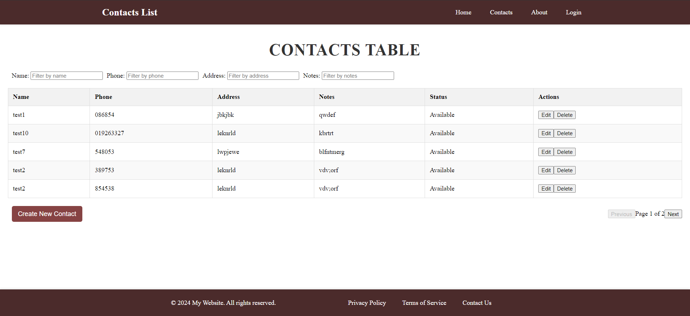
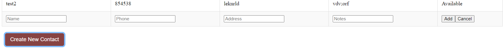
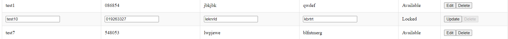
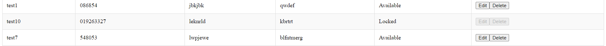
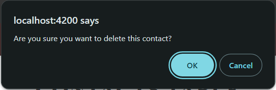
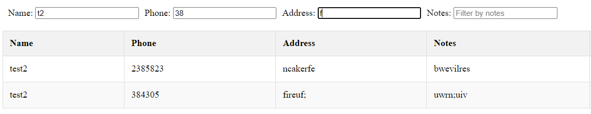

# Contacts List

This is a simple MEAN stack project that saves contacts in a table and allows creating, updating, deleting and filtering contacts in the table. Websockets is implemented to prevent multiple users from editing contacts at the same time. **Please make sure to check the disclaimer at the end of the README file.**

## Table of Contents

- [Installation](#installation)
- [Running the Project](#running-the-project)
- [Screenshots](#screenshots)
- [Disclaimer](#disclaimer)

## Installation

1. Clone the repository:

```bash
git clone https://github.com/AlySemsem/Contacts-List-MEAN.git
cd Contacts-List-MEAN
```

You should have two terminals open after cloning the repository; one for the frontend and one for the backend.

2. Install frontend dependencies

```bash
cd frontend/contacts-ui
npm install
```

3. Install backend dependencies

```bash
cd backend
npm install
```

## Running the Project

After successfully installing the dependencies you should now be able to run both the frontend and the backend parallelly. Keep in mind that the database connected is my own database so you can change it and use your own in the backend `config.js` file.

#### Frontend

To run the frontend application:

```bash
ng serve
```

then open your browser and navigate to `http://localhost:4200` and you should see the login page.

You can login with either of the following hardcoded users:

```
username: 'user1', password: 'user1'
username: 'user2', password: 'user2'
```

#### Backend

To run the backend application:

```bash
npm run dev
```

then open your browser and navigate to `http://localhost:3000` and if everything is setup correctly you should see `Hello, World!` on an empty page.

## Screenshots

#### Contacts Information in a Grid



#### Creating a Contact

After clicking the create new contact button a form will appear at the bottom of the table and once it is filled you can click the add button and the contact will be added at the bottom of the table.


#### Editing a Contact

If you click the edit button beside any of the contacts, the contact information will be in input fields where you can edit and update them freely.


If the form is being edited by a user the contact will be locked in real-time for all users so they will not be able to edit or delete the contact while it is being edited.


#### Deleting a Contact

If you click the delete button you will get a confirmation prompt and the contact will be deleted for all users.



#### Filtering the Contacts

Data can be filtered by multiple filters at the same time.


## Disclaimer

I have never used angular before therefore the frontend code might not be very clean or following a clear architecture or best practices.
